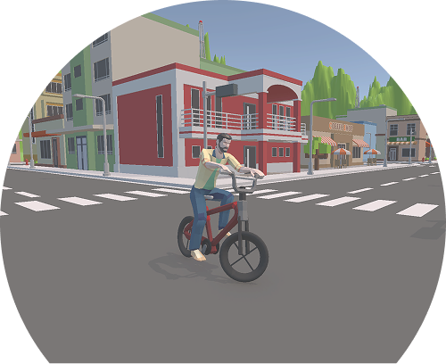
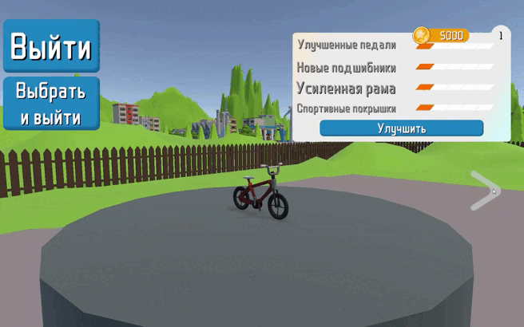
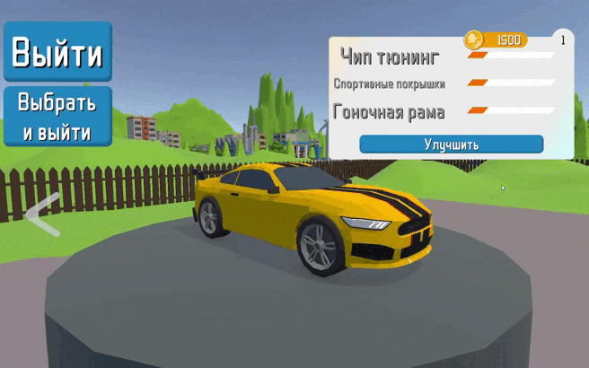
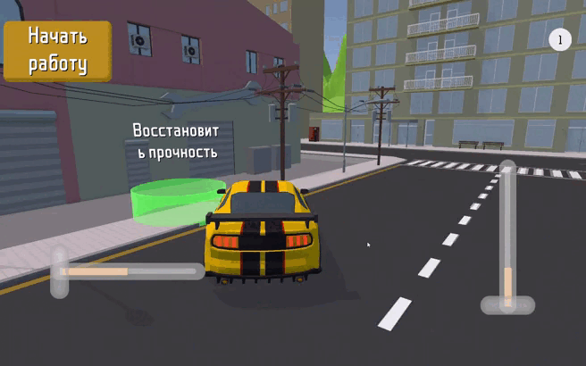
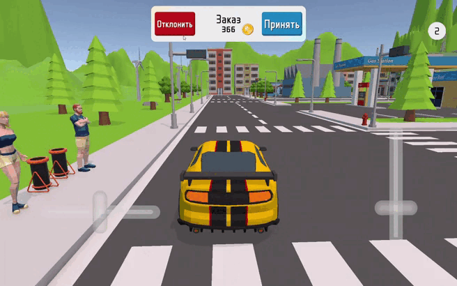

# Chaos Delivery

  <!-- Верхняя часть - картинка -->
  

    
  

  <!-- Нижняя часть - текст -->
  

    <h2 style="color: #2d2d2d; margin-bottom: 10px;">Chaos Delivery</h2>
    

      Это игра, про необычную и увлекательную доставку, разарботанная на Unity под WebGL платформу.
    

  

## Сюжет
Главный герой пытаешься бороться со скукой. К счастью тебе встречается странный мальчишка, у которого странным образом появился свой сервис доставки. 
Твоя задача — доставить все заказы вовремя, не задавая вопросы по поводу содержимого груза, в странном городе с злостной полицией и кучкой ненавистников службы доставки, в которой ты работаешьвв. 

## Гемплей
- Совершайте разнообразные заказы: <strong>обычные заказы</strong>, <strong>заказы на время</strong>, доставляйте <strong>контрабанду</strong>!

- Выбирайте и покупайте новый транспорт.

- Улучшайте текущий транспорт, увеличивая <strong>скорость</strong>, <strong>управляемость</strong> и <strong>прочность</strong>

- Старайтесь не врезатся, чтобы не допустить уничтожение машины. И регулярно заглядывать в автомастерскую, чтобы восстанавливать прочность.

- Притормаживайте перед постом полиции, чтобы не получить штраф!

- Но в то же время набирайте скорость, чтобы увернуться от помидоров хулиганов!

 

<h2>FAQ</h2>

<h3>Игровой процесс</h3>
Доставляйте грузы и получайте за них казах-коины и увеличивайте уровень. За монеты покупайте и улучшайте машины, а уровень разблокирует новые виды заказов.   
Вовремя восстанавливайте прочность в автосервисе чтобы не разбить транспорт.

<h3>Сохранение</h3>
Все покупки, примененные улучшения, выбранный транспорт, а также заработанные деньги и опыт сохраняются. И автоматически загружаются при повторном заходе в игру.

